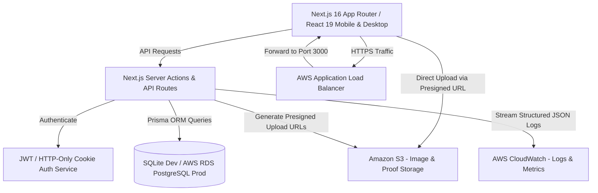
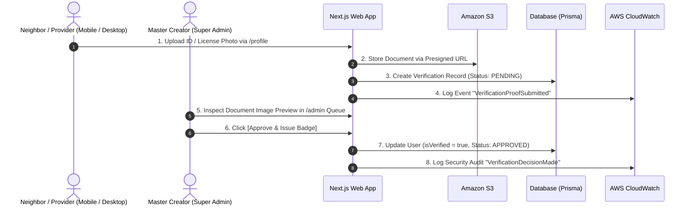
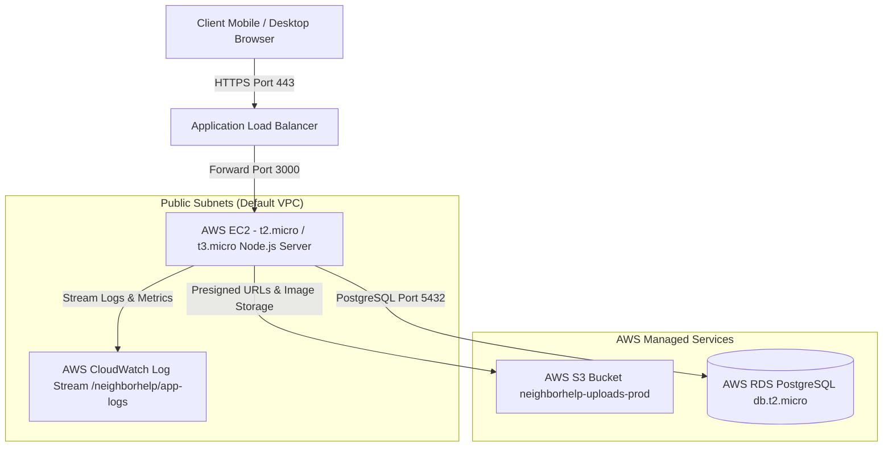

# NeighborHelp – Technical Architecture, Specification & Design System

> [!NOTE]
> **Project:** NeighborHelp – Neighborhood Skill & Service Exchange Platform  
> **Target Delivery:** Capstone MVP  
> **Document Version:** 2.1.0  
> **Design System:** "Trust & Warmth" (Strict Light Theme + Full Mobile Compatibility)  

---

## 1. Executive Summary & Architecture Overview

**NeighborHelp** is a community-driven web application designed to connect residents needing local service assistance (plumbing, electrical work, yard maintenance, drainage clearance, cleaning, handyman) with skilled neighbors and verified local service providers.



---

## 2. Technical Architecture & Technology Stack

### 2.1 Full Technology Stack

| Layer | Production Technology | Rationale |
| :--- | :--- | :--- |
| **Framework** | Next.js 16 (App Router) + React 19 | Server Component performance, static/dynamic route optimization, API router integration |
| **Styling & Responsive UI** | Vanilla Tailwind CSS v4 | Flexible token system, zero-runtime CSS, fluid mobile/desktop responsive design |
| **Typography** | Plus Jakarta Sans + Atkinson Hyperlegible | Modern display headlines paired with high-accessibility body text |
| **Database & ORM** | SQLite (Dev) / AWS RDS PostgreSQL (Prod) + Prisma ORM 6.19 | Type-safe queries, migration control, relational data integrity |
| **Media Pipeline** | Amazon S3 Presigned URLs | Direct mobile/desktop browser-to-S3 multi-photo dropzone & identity document uploader |
| **Security & Auth** | JWT (HTTP-Only Cookies) + `bcryptjs` | Role-based control (`SUPER_ADMIN`, `ADMIN`, `PROVIDER`, `RESIDENT`) |
| **Monitoring** | AWS CloudWatch Logs & Metrics | Structured JSON log group `/neighborhelp/app-logs` & operational metrics |
| **Hosting Infrastructure** | AWS EC2 + ALB + RDS + S3 + CloudWatch | AWS Free Tier scalable deployment |

---

## 3. Design System & Mobile Compatibility Specification

### 3.1 Color Palette & Token Definitions (Strict Light Theme)

```yaml
name: NeighborHelp System - Trust & Warmth
colors:
  surface: '#f8f9ff'
  surface-dim: '#d1dbec'
  surface-bright: '#f8f9ff'
  surface-container-lowest: '#ffffff'
  surface-container-low: '#eef4ff'
  surface-container: '#e5eeff'
  surface-container-high: '#dfe9fa'
  surface-container-highest: '#d9e3f4'
  on-surface: '#121c28'
  on-surface-variant: '#404943'
  outline: '#707973'
  outline-variant: '#bfc9c1'
  primary: '#0f5238'              # Community Green
  on-primary: '#ffffff'
  primary-container: '#2d6a4f'
  on-primary-container: '#a8e7c5'
  secondary: '#1d4ed8'            # Trust Blue (Verified Badge)
  on-secondary: '#ffffff'
  secondary-container: '#4069f2'
  error: '#ba1a1a'
```

### 3.2 Mobile Responsiveness & Touch Optimization Guidelines

* **Touch Targets**: All primary buttons, action pills, and form inputs strictly enforce a **48px minimum touch height** (`min-h-[48px]` / `h-12`) to prevent mis-clicks on mobile touchscreens (iOS Safari & Android Chrome).
* **Fluid Grid Breakpoints**:
  * **Mobile Viewports (`< 640px`)**: Single-column layout (`grid-cols-1`), stacked action buttons, horizontal scrolling skill filters (`overflow-x-auto scrollbar-none`), mobile drawer navigation header with quick role switcher.
  * **Tablet Viewports (`640px - 1024px`)**: 2-column cards grid (`sm:grid-cols-2`), compact hero layout.
  * **Desktop Viewports (`> 1024px`)**: 4-column cards grid (`lg:grid-cols-4`), 12-column hero container, top inline navigation search bar.
* **Mobile Data Tables & Modals**:
  * All data tables (Admin user list, verification queue) are wrapped in horizontal scroll containers (`overflow-x-auto`) to guarantee zero horizontal clipping on small screens.
  * Modal dialogs (Apply for Job modal, Review submission modal, Document Preview modal) feature responsive max-widths and scrollable viewports (`max-h-[90vh] overflow-y-auto`).

### 3.3 Typography Guidelines
* **Headlines & Display Text**: **Plus Jakarta Sans** (`font-display`)
  * `display-lg`: 48px / 56px line-height, bold (700/800).
  * `headline-lg`: 32px / 40px line-height, semi-bold (600).
  * `title-md`: 20px / 28px line-height, semi-bold (600).
* **Body & Interface Text**: **Atkinson Hyperlegible** (`font-body`)
  * `body-lg`: 18px / 28px line-height, regular (400).
  * `body-md`: 16px / 24px line-height, regular (400).
  * `label-md`: 14px / 20px line-height, bold (700).

---

## 4. Security & Identity Verification Pipeline

### 4.1 Role Hierarchy & Permissions
1. **Master Super Admin (Application Creator)**: Master role (`SUPER_ADMIN` / `ADMIN`) with full access to `/admin`. Inspects verification proof documents and moderates content.
2. **Verified Provider**: Service provider verified by the Creator Admin with the **Trust Blue Verified Badge** (`#1d4ed8`).
3. **Pending Provider**: Service provider with submitted identity proof document awaiting Creator Admin approval.
4. **Resident**: Community member creating help requests and selecting local helpers.



---

## 5. Entity Relationship & Data Models

```mermaid
erDiagram
    USER ||--o{ POST : creates
    USER ||--o{ BOOKING : applies_or_receives
    USER ||--o{ REVIEW : writes_or_receives
    POST ||--o{ POST_PHOTO : contains
    POST ||--o{ BOOKING : yields
    BOOKING ||--o1 REVIEW : results_in

    USER {
        string id PK
        string name
        string email
        string passwordHash
        string role "RESIDENT | PROVIDER | ADMIN | SUPER_ADMIN"
        string phone
        string locationNeighborhood
        text bio
        string avatarUrl
        string skills
        boolean isVerified
        string verificationProofUrl
        string verificationStatus "UNSUBMITTED | PENDING | APPROVED | REJECTED"
        datetime verificationSubmittedAt
        datetime createdAt
    }

    POST {
        string id PK
        string authorId FK
        string postType "NEED_HELP | CAN_HELP"
        string title
        text description
        string skillCategory
        string locationNeighborhood
        string urgency "LOW | MEDIUM | HIGH | EMERGENCY"
        string status "OPEN | IN_PROGRESS | COMPLETED | CANCELLED"
        datetime createdAt
    }

    POST_PHOTO {
        string id PK
        string postId FK
        string s3Url
        datetime createdAt
    }

    BOOKING {
        string id PK
        string postId FK
        string providerId FK
        string residentId FK
        string proposedTime
        text message
        string status "PENDING | ACCEPTED | REJECTED | COMPLETED | CANCELLED"
        datetime createdAt
    }

    REVIEW {
        string id PK
        string bookingId FK
        string reviewerId FK
        string revieweeId FK
        int rating "1 to 5"
        text comment
        datetime createdAt
    }
```

---

## 6. Page Wireframe & Route Specifications

### 6.1 Route Index
- **`/`**: Discovery Hub homepage featuring search bar, skill filters (`Plumbing`, `Electrical`, `Yard Work`, `Drainage`, `Cleaning`, `General Handyman`), post grid cards with Trust Blue badges, 3-step community section, and Super Neighbors spotlight. Fully mobile responsive.
- **`/posts/create`**: Post creation page featuring post type toggle (`NEED_HELP` / `CAN_HELP`), skill selector, urgency dropdown, and S3 Multi-Photo Dropzone.
- **`/posts/[id]`**: Interactive post detail page with photo lightbox gallery, problem details, resident contact info, provider scheduling application modal, and application acceptance controls.
- **`/dashboard`**: User dashboard with tabs for `My Active Posts`, `Active & Pending Bookings`, and `Completed Jobs & Reviews`.
- **`/profile`**: Profile management page featuring personal details editor, skill catalog, client reviews received, and the **Neighborhood Security & Identity Verification** submission card.
- **`/admin`**: Creator Admin Control Panel featuring analytics metrics, **Verification Approval Queue** with document preview modal, user management, post moderation queue, and CloudWatch Security Log terminal.
- **`/login` & `/register`**: Auth pages with 1-click demo account switcher.

---

## 7. AWS Free Tier Production Deployment Specifications

### 7.1 AWS Architecture Diagram



### 7.2 Security Groups Configuration
1. **`sg-alb` (Load Balancer)**: Inbound HTTP (80) & HTTPS (443) from `0.0.0.0/0`.
2. **`sg-ec2` (Next.js Application)**: Inbound Port 3000 from `sg-alb` ONLY; SSH (22) from Admin IP ONLY.
3. **`sg-rds` (PostgreSQL Database)**: Inbound PostgreSQL (5432) from `sg-ec2` ONLY.

---

## 8. Prioritized Backlog (MoSCoW Framework)

| ID | Title | Priority | Status | Scope Summary |
| :--- | :--- | :--- | :--- | :--- |
| **NH-01** | User Auth & JWT | **Must Have** | ✅ Completed | Auth Context with HTTP-Only JWT cookies and demo switcher |
| **NH-02** | Profile & Verification Form | **Must Have** | ✅ Completed | Profile editor + ID / Skilled Trade verification proof uploader |
| **NH-03** | Post CRUD & Filters | **Must Have** | ✅ Completed | Full post creation, detail view, search, skill, and location filtering |
| **NH-04** | S3 Photo Upload Pipeline | **Must Have** | ✅ Completed | Presigned URL upload dropzone for posts & verification documents |
| **NH-05** | Booking & Schedule Modal | **Must Have** | ✅ Completed | Provider application workflow with schedule proposal |
| **NH-06** | Acceptance & Reviews | **Must Have** | ✅ Completed | Application accept/reject controls & 1-5 star review modal |
| **NH-07** | Creator Admin Security Panel | **Must Have** | ✅ Completed | Verification approval queue with document preview modal |
| **NH-08** | Light Theme & Mobile UI | **Must Have** | ✅ Completed | "Trust & Warmth" token palette, 48px touch targets, mobile drawer menu |
| **NH-09** | AWS CloudWatch Integration | **Must Have** | ✅ Completed | Structured JSON logger & admin live log stream terminal |
| **NH-10** | AWS Free Tier Plan | **Should Have** | ✅ Completed | Step-by-step EC2, S3, RDS, ALB, Security Group deployment guide |
